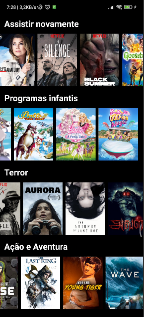
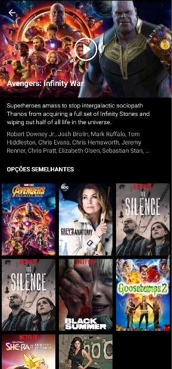

# Aplicativo de filmes feito em kotlin :)

## Navegue aqui :3

* [To do](#to-do)
* [Informações gerais](#informações-gerais)
* [Capturas de tela](#screenshots)
* [Tecnologias](#tecnologia)
* [Setup](#setup)
* [License](#license)

## Informações gerais

Este projeto foi feito em kotlin, e tem objetivo central, criar um aplicativo nativo semelhante ao netflix,
ele consome uma API feita por mim, e está disponível nesse mesmo repositório, na branch youflix-api,
elementos básicos, usando o mais proximo possivel do código puro para fazer requisições WEB.

## To do

- [ ] Splash Screen
- [x] Tela Inicial
- [x] Tela do filme(filme/série)
- [x] API-Básica de títulos, descrição, cast, imagens.
- [x] Consumir API-Básica.
- [ ] Api filmes/séries videos .mp4 e consumir em servidor.
- [ ] PlayerVideo
- [ ] IA ou Graph Algoritm - Opção semelhante

## Screenshots
 
<p float="left">
   
  
</p>

## Tecnologia

#### Linguagens:

- Kotlin 
- Xml

#### Arquitetura usada:
- MVC

#### Libraries:

- Picasso(https://github.com/square/picasso)

## Setup

Para rodar esse projeto, instale-o baixando ou clonando o repositório.

#### Requisitos do sistema 

- Ter um computador
- Android Studio Chipmunk | 2021.2.1
- Minimum sdk v21
- Compile sdk v32

## Licença

```html
MIT Licence 

Copyright (c) 2022 Wanderley Filho

Permission is hereby granted, free of charge, to any person obtaining a copy of this software
and associated documentation files (the "Software"), to deal in the Software without restriction,
including without limitation the rights to use, copy, modify, merge, publish, distribute, sublicense,
and/or sell copies of the Software, and to permit persons to whom the Software is furnished to do so, 
subject to the following conditions:

The above copyright notice and this permission notice shall be included in all copies or substantial 
portions of the Software.

THE SOFTWARE IS PROVIDED "AS IS", WITHOUT WARRANTY OF ANY KIND, EXPRESS OR IMPLIED, 
INCLUDING BUT NOT LIMITED TO THE WARRANTIES OF MERCHANTABILITY, FITNESS FOR A PARTICULAR PURPOSE
AND NONINFRINGEMENT.IN NO EVENT SHALL THE AUTHORS OR COPYRIGHT HOLDERS BE LIABLE FOR ANY CLAIM,
DAMAGES OR OTHER LIABILITY, WHETHER IN AN ACTION OF CONTRACT,
TORT OR OTHERWISE, ARISING FROM, OUT OF OR IN CONNECTION WITH THE SOFTWARE
OR THE USE OR OTHER DEALINGS IN THE SOFTWARE.
```
